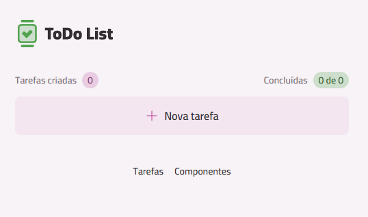
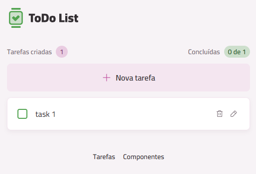
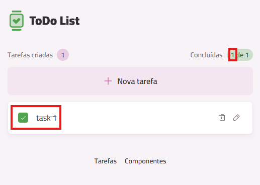

## Screenshots

- Home (empty state, persisted via Local Storage)
  - Shows the landing view when there are no tasks yet. The app reads initial state from the browser’s Local Storage, so returning users see their previously saved tasks immediately.
  - 

- First Task Added
  - Demonstrates creating the first task and the immediate update of the task list. This confirms add interactions and visual feedback for newly created items.
  - 

- Task Completion & Progress Indicator
  - Highlights marking a task as done and the aggregate completion indicator at the top. This view validates the completed state styling and progress counts.
  - 

- Components Showcase
  - A dedicated page that displays all UI components and their style variants. Useful for design review, rapid iteration, and visual regression checks.
  - 

# React + TypeScript + Vite

This template provides a minimal setup to get React working in Vite with HMR and some ESLint rules.

Currently, two official plugins are available:

- [@vitejs/plugin-react](https://github.com/vitejs/vite-plugin-react/blob/main/packages/plugin-react) uses [Babel](https://babeljs.io/) for Fast Refresh
- [@vitejs/plugin-react-swc](https://github.com/vitejs/vite-plugin-react/blob/main/packages/plugin-react-swc) uses [SWC](https://swc.rs/) for Fast Refresh

## Expanding the ESLint configuration

If you are developing a production application, we recommend updating the configuration to enable type-aware lint rules:

```js
export default tseslint.config({
  extends: [
    // Remove ...tseslint.configs.recommended and replace with this
    ...tseslint.configs.recommendedTypeChecked,
    // Alternatively, use this for stricter rules
    ...tseslint.configs.strictTypeChecked,
    // Optionally, add this for stylistic rules
    ...tseslint.configs.stylisticTypeChecked,
  ],
  languageOptions: {
    // other options...
    parserOptions: {
      project: ['./tsconfig.node.json', './tsconfig.app.json'],
      tsconfigRootDir: import.meta.dirname,
    },
  },
})
```

You can also install [eslint-plugin-react-x](https://github.com/Rel1cx/eslint-react/tree/main/packages/plugins/eslint-plugin-react-x) and [eslint-plugin-react-dom](https://github.com/Rel1cx/eslint-react/tree/main/packages/plugins/eslint-plugin-react-dom) for React-specific lint rules:

```js
// eslint.config.js
import reactX from 'eslint-plugin-react-x'
import reactDom from 'eslint-plugin-react-dom'

export default tseslint.config({
  plugins: {
    // Add the react-x and react-dom plugins
    'react-x': reactX,
    'react-dom': reactDom,
  },
  rules: {
    // other rules...
    // Enable its recommended typescript rules
    ...reactX.configs['recommended-typescript'].rules,
    ...reactDom.configs.recommended.rules,
  },
})

## pnpm Installation

- Prerequisites: `Node.js >= 18.12`.
- Install pnpm via Corepack (recommended):

```bash
npm install --global corepack@latest
corepack enable pnpm
corepack use pnpm@latest-10
```

- Alternative via npm:

```bash
npm install -g pnpm@latest-10
```

- Install project dependencies:

```bash
pnpm install
```

- Approve native build scripts (for `@swc/core` and `esbuild`):

```bash
pnpm approve-builds
```

- Development server:

```bash
pnpm dev
```

- Production build:

```bash
pnpm build
```

- Preview the build:

```bash
pnpm preview
```

- Lint:

```bash
pnpm lint
```

### Tips

- Offline install: `pnpm i --offline` (uses only packages already in the store).
- CI: `pnpm i --frozen-lockfile` (doesn’t update the lockfile and fails if out of sync).
- Workspace: in workspaces, `pnpm install` installs all projects; use `--filter` to scope if needed.